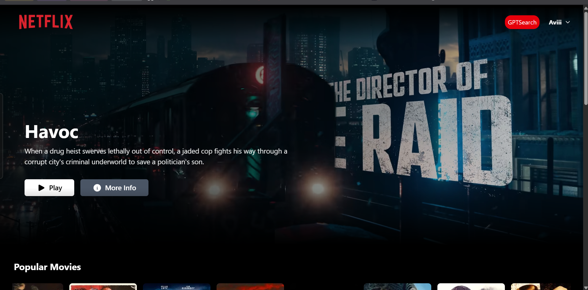

# NetflixGPT

A modern React application for discovering and exploring movies with AI-powered search capabilities and personalized recommendations.

🎬 **Live Demo**: [netflix-gpt-seven-alpha.vercel.app](https://netflix-gpt-seven-alpha.vercel.app/)

## 📋 Features

- **AI-Powered Search**: GPT-integrated intelligent movie recommendations
- **Movie Discovery**: Browse popular, top-rated, and upcoming movies
- **Smart Filters**: Search by genre, keywords, and preferences
- **Multi-language Support**: Internationalization ready interface
- **Responsive Design**: Optimized for all device sizes
- **Firebase Authentication**: Secure user authentication and management

## 🖼️ Screenshot



## 🚀 Getting Started

### Prerequisites

- Node.js (v14.x or later)
- npm or yarn

## 🛠️ Tech Stack

- **Frontend**: React 19, Vite, TailwindCSS
- **State Management**: Redux Toolkit
- **Authentication**: Firebase Auth
- **AI Integration**: OpenAI GPT API
- **Routing**: React Router v7
- **Deployment**: Vercel

## 🚀 Getting Started

### Prerequisites

- Node.js (v16.x or later)
- npm or yarn
- Firebase project (for authentication)
- OpenAI API key (for GPT features)

### Installation

1. Clone the repository
   ```bash
   git clone https://github.com/Avi1606/netflix-gpt.git
   cd netflix-gpt
   ```

2. Install dependencies
   ```bash
   npm install
   ```

3. Set up environment variables
   - Create a `.env` file in the root directory
   - Add your Firebase and OpenAI configurations:
   ```env
   VITE_OPENAI_API_KEY=your_openai_api_key
   VITE_FIREBASE_API_KEY=your_firebase_api_key
   VITE_FIREBASE_AUTH_DOMAIN=your_auth_domain
   VITE_FIREBASE_PROJECT_ID=your_project_id
   ```

4. Start the development server
   ```bash
   npm run dev
   ```

5. Build for production
   ```bash
   npm run build
   ```

## 📁 Project Structure

```
netflix-gpt/
├── src/
│   ├── components/         # React components
│   │   ├── Browse.jsx     # Main browsing interface
│   │   ├── Header.jsx     # Navigation header
│   │   ├── Login.jsx      # Authentication component
│   │   ├── GptSearchBar.jsx # AI search interface
│   │   └── MovieList.jsx  # Movie display components
│   ├── hooks/             # Custom React hooks
│   ├── App/               # Redux store and slices
│   ├── Utils/             # Utilities and constants
│   └── assets/            # Static assets
├── public/                # Public assets
├── package.json
└── vite.config.js
```

## 🔧 Configuration

### Firebase Setup
1. Create a new Firebase project
2. Enable Authentication with Email/Password
3. Add your domain to authorized domains
4. Copy the config keys to your `.env` file

### OpenAI Setup
1. Create an OpenAI account
2. Generate an API key
3. Add the key to your `.env` file

## 🎯 Core Features

### Movie Discovery
- Browse popular, top-rated, and upcoming movies
- View detailed movie information and trailers
- Responsive movie cards with smooth animations

### AI-Powered Search
- Natural language movie queries
- Intelligent recommendations based on preferences
- Multi-language search support

### User Authentication
- Secure login/signup with Firebase
- User session management
- Protected routes and personalized experience

## 🤝 Contributing

1. Fork the repository
2. Create your feature branch (`git checkout -b feature/AmazingFeature`)
3. Commit your changes (`git commit -m 'Add some AmazingFeature'`)
4. Push to the branch (`git push origin feature/AmazingFeature`)
5. Open a Pull Request

## 📄 License

This project is licensed under the MIT License - see the [LICENSE](LICENSE) file for details.

## 🙏 Acknowledgments

- [TMDB API](https://www.themoviedb.org/documentation/api) for movie data
- [OpenAI](https://openai.com/) for GPT integration
- [Firebase](https://firebase.google.com/) for authentication
- [React](https://reactjs.org/) and [Vite](https://vitejs.dev/) for the development experience
